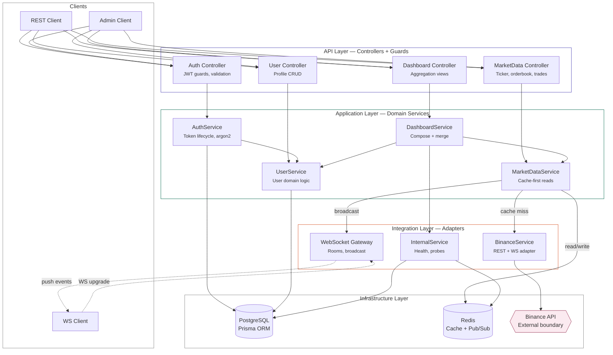
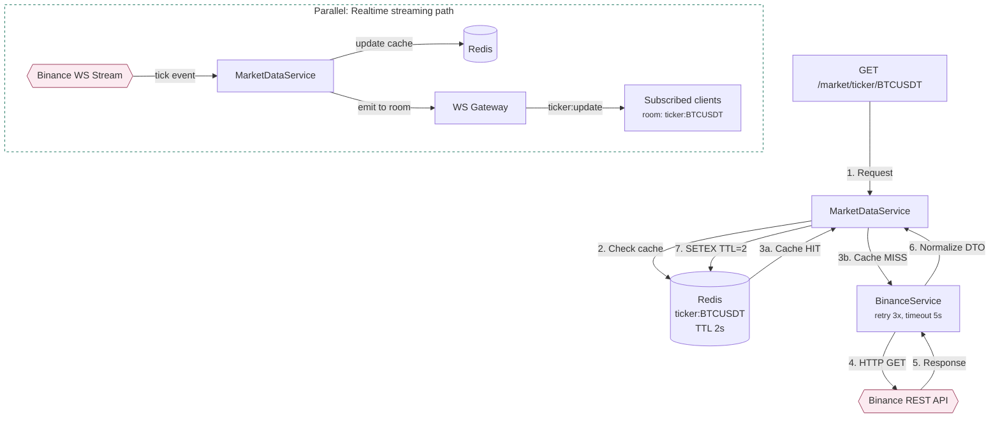
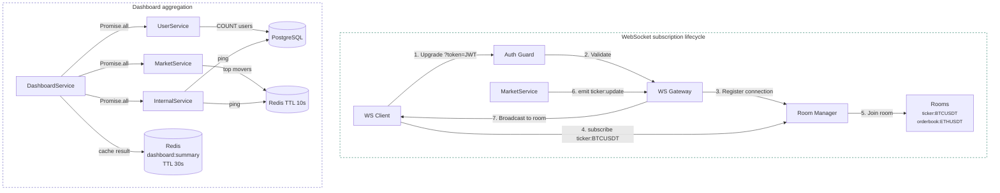

# Refined architecture diagrams — Mermaid source

These Mermaid diagrams correspond to the three SVG visuals rendered in the conversation.
Paste any of them into mermaid.live, GitHub markdown, or Notion to render.

---

## Diagram 1: Layered architecture overview

---

## Diagram 2: Market data flow (cache hit/miss + realtime)

---

## Diagram 3: WebSocket subscription + Dashboard aggregation

